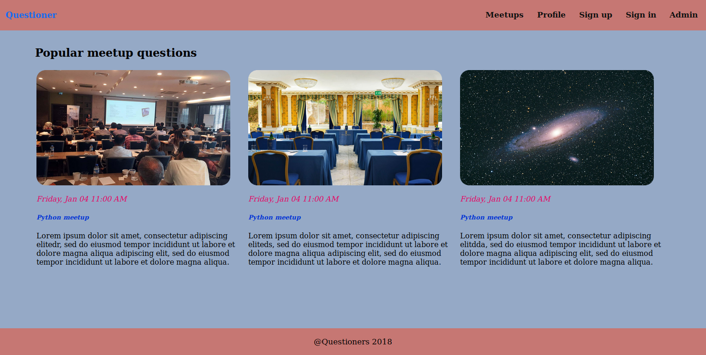
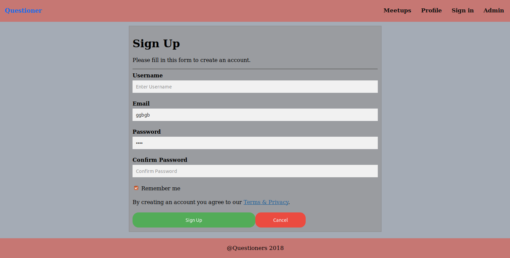
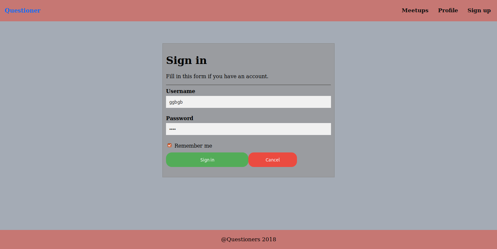

# QUESTIONER 
Questioner helps the meetup organizer prioritize questions to be answered. Other users can vote on asked questions and they bubble to the top or bottom of the log.

Please click [https://philipotieno.github.io/Questioner/](https://philipotieno.github.io/Questioner/) to view my UI pages

